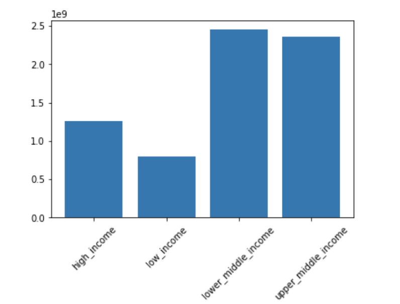
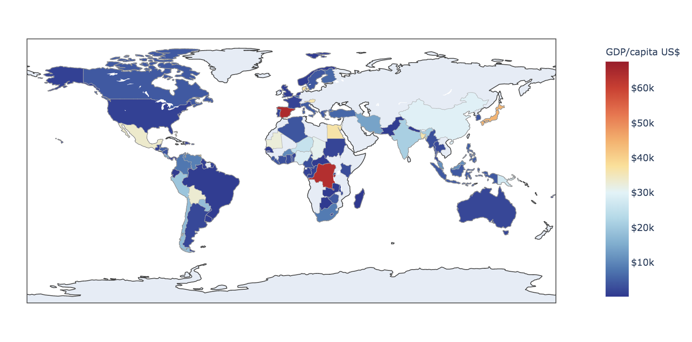
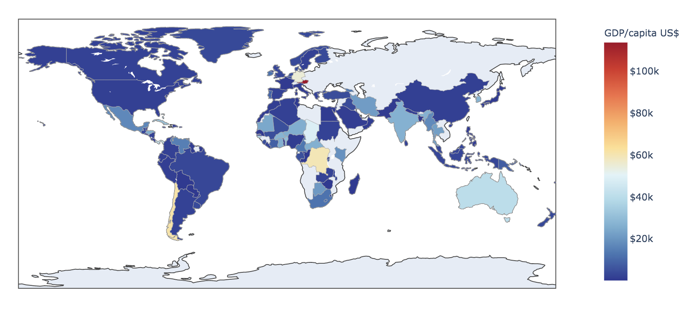
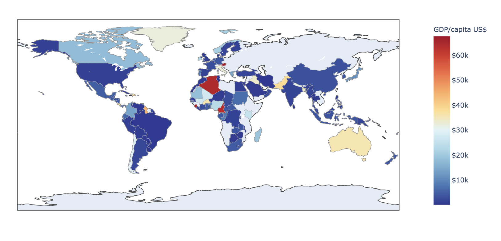
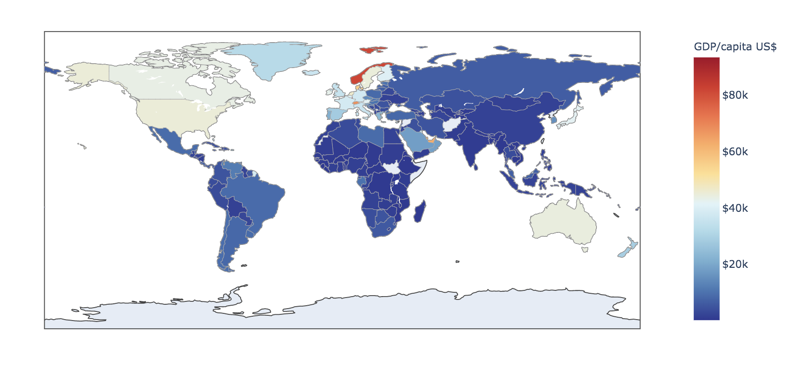
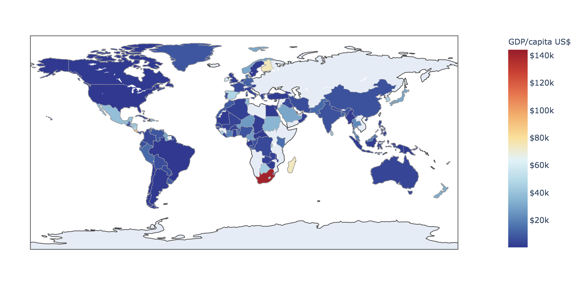
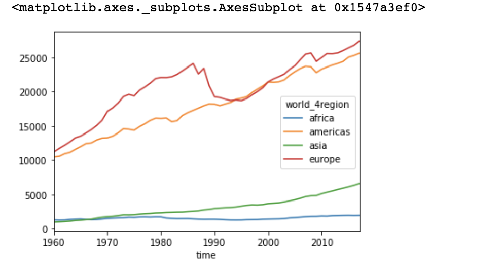
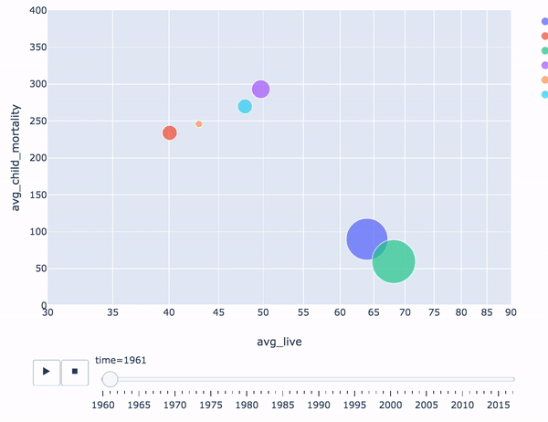
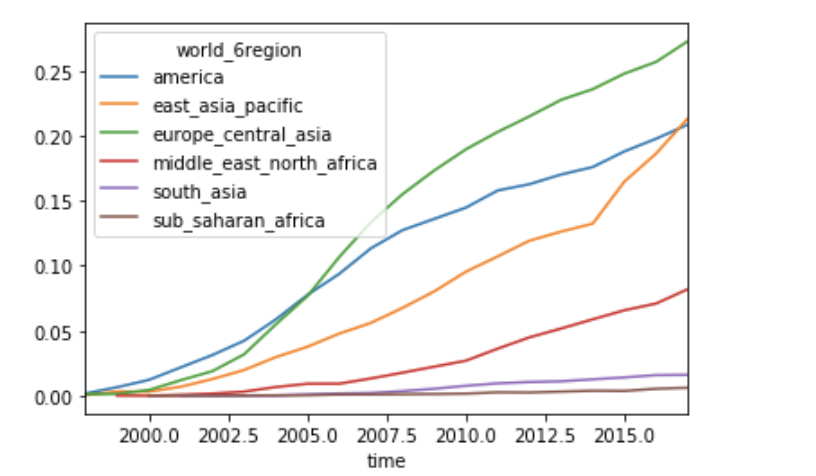

# DS5500

## Question One

**What score did you receive?**

24%

**Did any of the answers surprise you?**

I am kind of superised that the world is not as bad as I thought. Such as majority of the world population live middle income countries, and the life expectancy of the world population is 70 years. 

**Choose a question from the test, re-state it, and answer it using visualization and summarization. Provide a figure and any relevant output with your answer.**

Original question : Where does the majority of the world population live?

Re-state: what's the distribution of current world-wide population in terms of income level.

I used population dataset to get population data along with country code. And merged with country dataset, where have income group. Used groupby function to calculate the number of population within each income group.

## Question 2

**Visualize the distribution of income (GDP / capita) across countries and continents, and how the distribution
of income changes over time**

GDP cross country

1960

 
GDP per capita cross country in 1960

1970

GDP per capita cross country in 1970

1980

1990

2000

2010

GDP cross continent

** Interpret the visualization and what you notice. Are they any notable trends and/or deviations from that
trend?  What caveats apply to your conclusions? ** **

Overall, the gdp per capita is increasing for most of region, but for affrica, the gdppercapita does not quite improve. Also the difference between highly developped area and low level developped area is increasing accross time. The reason may be regional war, gaming between super power, or so.

## Question 3
**Use visualization to investigate the relationship between income (GDP / capita), life expectancy, and child
mortality over time. How does each measure change over time within each continent?
Interpret your visualizations, noting any trends and/or outliers.**

## Question 4

**Choose two variables you have not investigated yet, and visualize their distributions, their relationship with
each other, and how these change over time.
Interpret your visualizations, noting any trends and/or outliers.**

I choose to analysis the trend of the broadband subscribers. It turns out the broadband subscribing level is raising really quick since 2012 and already surpass the proportion of european. East asian and pacific area now have the largest number of broadband subscribers. But none of any continent region have reach 30% subscribing rate, there is still huge market of broadband internet.

average broadband subscriber

total broadband subscriber

## Question 5
**Did you use static or interactive plots to answer the previous problems?
Explore the data using the interactive visualization tools at https://www.gapminder.org/tools, and watch
the TED talk ?The best stats you have ever seen? at https://www.youtube.com/watch?v=hVimVzgtD6w.
Discuss the advantages, disadvantages, and relative usefulness of using interactive/dynamic visualizations
versus static visualizations.**

Dynamic visualization is easier for user to capture the trend. Better for interactive media such as web page or mobile device.
But static visualization is more time efficient in term of information deliver. Also better for static media.

